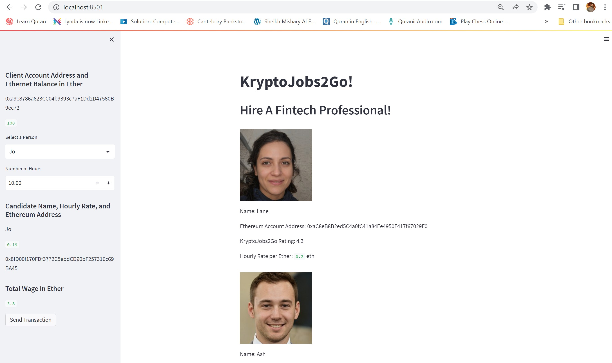
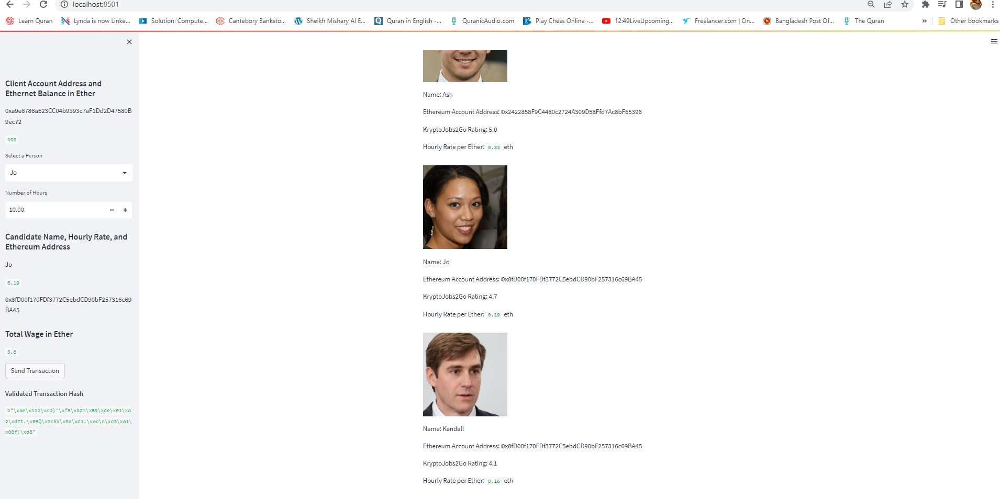
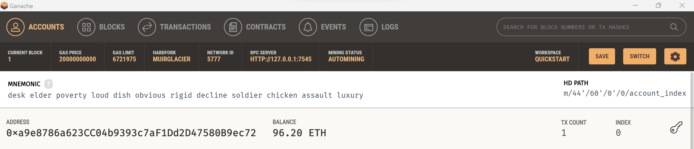
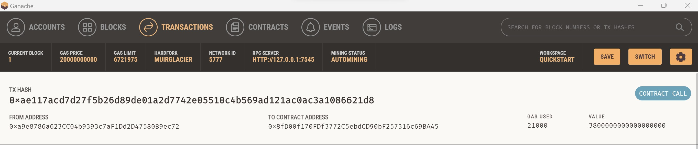

## Unit 19 Homework: Cryptocurrency Wallet

## Streamlit Application
After Running the Assignment with Steamlit the web applicaiton opens up the web form to select person and number of hours. 

### Picture 1:  After running the application with Steamlit from GitBash Terminal
  

### Picture 2: After Selecting the Person and Number of Hours
  
 
 ### Picture 3: The balance of the index 0 in Ganache
  

 ### Picture 4: The details of the transaction in Ganache
  